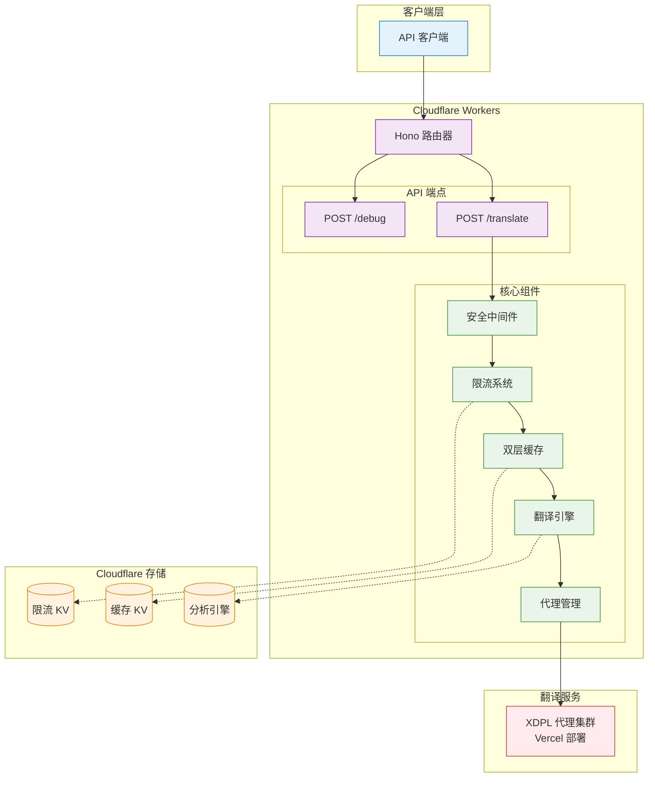

# DeepLX

***[English](README.md)***

[](#-许可证)
[](#-在线服务)
[](#-自部署)

目前 [DeepLX](https://github.com/OwO-Network/DeepLX) 的最佳无服务器实现，专为 Cloudflare Workers 优化设计。通过智能代理端点轮换、高级限流算法和熔断器机制，几乎完全避免了 HTTP 429 错误，提供比 DeepL API 更高的请求速率限制和更低的网络往返时间。

## 🆓 **相较于 DeepL API 完全免费**

**与付费的 DeepL API 不同，DeepLX 完全免费使用** - 无需 API 密钥、无订阅费用、无使用限制。只需部署一次，即可享受无限制的翻译请求，无需担心任何费用问题。

## ✨ 特性与性能优势

### 🚀 性能优势

DeepLX 在性能和稳定性方面相较于 DeepL API 有显著提升，以下是基于特定网络环境下的关键指标对比：

| 指标 | DeepL API | DeepLX (预部署实例) |
|------|-----------|-------------------|
| 速率限制 | 50 请求/秒 | 80 请求/秒 (8 请求/秒 × 10 代理端点) |
| 平均网络往返时间 | ~450ms | ~180ms (边缘网络加速) |
| HTTP 429 错误率 | 10-30% | <1% |
| 并发支持 | 单端点限制 | 多端点负载均衡 |
| 地理分布 | 有限 | 全球 330+ 边缘节点 |

#### 核心性能特性

- **更高速率限制**：智能负载均衡，比 DeepL API 支持更高的并发请求
- **更低延迟**：基于 Cloudflare Workers 的全球边缘网络部署
- **零冷启动**：无服务器架构，瞬时响应
- **智能缓存**：双层缓存系统（内存 + KV 存储）减少重复请求

#### 技术优势

- **智能负载均衡**：多个代理端点自动分发请求
- **动态限流算法**：基于代理数量自动调整速率限制
- **双层缓存系统**：内存缓存 + KV 存储减少重复请求
- **熔断器机制**：故障端点自动切换，保证服务连续性
- **边缘计算**：Cloudflare Workers 全球部署，降低延迟

### 🛡️ 稳定性保障

- **避免 HTTP 429 错误**：通过代理端点轮换和令牌桶算法几乎完全避免限流
- **熔断器机制**：自动检测故障端点并进行故障转移
- **指数退避重试**：智能重试机制提高成功率

### 🔒 安全特性

- **输入验证**：全面的参数校验和文本清理
- **速率限制**：基于客户端 IP 和代理端点的多维度限流
- **CORS 支持**：灵活的跨域资源共享配置
- **安全头部**：自动添加安全相关的 HTTP 头部
- **错误净化**：敏感信息永不暴露

## 🏗️ 架构概览



## 🌐 在线服务

**预部署实例**：`https://dplx.xi-xu.me`

## 📦 快速开始

### cURL 示例

```bash
curl -X POST https://dplx.xi-xu.me/translate \
  -H "Content-Type: application/json" \
  -d '{
    "text": "Hello, world!",
    "source_lang": "EN",
    "target_lang": "ZH"
  }'
```

### JavaScript 示例

```javascript
async function translate(text, sourceLang = 'auto', targetLang = 'zh') {
  const response = await fetch('https://dplx.xi-xu.me/translate', {
    method: 'POST',
    headers: {
      'Content-Type': 'application/json',
    },
    body: JSON.stringify({
      text: text,
      source_lang: sourceLang,
      target_lang: targetLang
    })
  });
  
  const result = await response.json();
  return result.data;
}

// 使用示例
translate('Hello, world!', 'en', 'zh')
  .then(result => console.log(result))
  .catch(error => console.error(error));
```

### Python 示例

```python
import requests
import json

def translate(text, source_lang='auto', target_lang='zh'):
    url = 'https://dplx.xi-xu.me/translate'
    data = {
        'text': text,
        'source_lang': source_lang,
        'target_lang': target_lang
    }
    
    response = requests.post(url, json=data)
    result = response.json()
    
    if result['code'] == 200:
        return result['data']
    else:
        raise Exception(f"翻译失败: {result.get('message', '未知错误')}")

# 使用示例
try:
    result = translate('Hello, world!', 'en', 'zh')
    print(result)
except Exception as e:
    print(f"错误: {e}")
```

## API 客户端集成

配置 API 客户端以使用预部署实例：

### [沉浸式翻译](https://immersivetranslate.com/zh-Hans/)（闭源浏览器扩展）

1. [安装沉浸式翻译](https://immersivetranslate.com/zh-Hans/download/)
2. 进入开发者设置并开启 beta 测试特性
3. 进入翻译服务添加自定义翻译服务 DeepLX，将 API URL 设置为：`https://dplx.xi-xu.me/translate`
4. 将每秒最大请求数和每次请求最大文本长度设置为合适的值（例如 `80` 和 `5000`），以确保稳定性和性能

### [Pot](https://github.com/pot-app/pot-desktop)（开源跨平台 Windows、macOS 和 Linux 应用）

1. [下载并安装适用于您平台的 Pot](https://github.com/pot-app/pot-desktop/releases/latest)
2. 打开 Pot 设置并导航到服务设置
3. 将 DeepL 服务类型配置为 DeepLX，并将自定义 URL 设置为：`https://dplx.xi-xu.me/translate`

### [Bob](https://bobtranslate.com/)（闭源 macOS 应用）

1. [从 Mac App Store 下载并安装 Bob](https://apps.apple.com/cn/app/id1630034110)
2. 下载并安装 [bob-plugin-deeplx](https://github.com/missuo/bob-plugin-deeplx) 插件
3. 配置插件使用 `https://dplx.xi-xu.me/translate`

## 🚀 自部署

[](https://deploy.workers.cloudflare.com/?url=https://github.com/xixu-me/DeepLX)

### 前置要求

- Node.js 18+
- Cloudflare Workers 账户
- Wrangler CLI

### 1. 克隆存储库

```bash
git clone https://github.com/xixu-me/DeepLX.git
cd DeepLX
```

### 2. 安装依赖

```bash
npm install
```

### 3. 配置环境

编辑 `wrangler.jsonc` 文件，更新以下配置：

```jsonc
{
  "account_id": "你的_CLOUDFLARE_账户_ID",
  "name": "你的_Worker_名称",
  "vars": {
    "DEBUG_MODE": "false",
    "PROXY_URLS": "你的代理端点列表,用逗号分隔"
  }
}
```

### 4. 创建 KV 命名空间

```bash
# 创建缓存 KV 命名空间
npx wrangler kv namespace create "CACHE_KV"

# 创建限流 KV 命名空间  
npx wrangler kv namespace create "RATE_LIMIT_KV"
```

将返回的命名空间 ID 更新到 `wrangler.jsonc` 的 `kv_namespaces` 配置中。

### 5. 部署到 Cloudflare Workers

```bash
# 开发环境
npx wrangler dev

# 生产部署
npx wrangler deploy
```

## 🔧 代理端点部署

为了获得最佳性能和稳定性，建议部署尽可能多的 [XDPL](https://github.com/xixu-me/XDPL) 代理端点：

### 快速部署 XDPL

[](https://vercel.com/new/clone?repository-url=https://github.com/xixu-me/XDPL)

### 配置代理端点

1. 部署多个 XDPL 实例
2. 将部署后的 URL 添加到 DeepLX 的 `PROXY_URLS` 环境变量中：

```jsonc
{
  "vars": {
    "PROXY_URLS": "https://your-xdpl-1.vercel.app/jsonrpc,https://your-xdpl-2.vercel.app/jsonrpc,https://your-xdpl-3.vercel.app/jsonrpc,https://your-xdpl-n.vercel.app/jsonrpc"
  }
}
```

## 📖 API 参考

### `/translate`

**请求方法**：`POST`

**请求标头**：`Content-Type: application/json`

**请求参数**：

| 参数 | 类型 | 说明 | 是否必要 |
| - | - | - | - |
| `text`        | string | 要翻译的文本 | 是 |
| `source_lang` | string | 源语言代码 | 否，默认值 `AUTO` |
| `target_lang` | string | 目标语言代码 | 否，默认值 `EN` |

**响应**：

```json
{
  "code": 200,
  "data": "翻译结果",
  "id": "随机标识符",
  "source_lang": "检测到的源语言代码",
  "target_lang": "目标语言代码"
}
```

**支持的语言代码**：

- `AUTO` - 自动检测（仅作为源语言）
- `AR` - 阿拉伯语
- `BG` - 保加利亚语
- `CS` - 捷克语
- `DA` - 丹麦语
- `DE` - 德语
- `EL` - 希腊语
- `EN` - 英语
- `ES` - 西班牙语
- `ET` - 爱沙尼亚语
- `FI` - 芬兰语
- `FR` - 法语
- `HE` - 希伯来语
- `HU` - 匈牙利语
- `ID` - 印尼语
- `IT` - 意大利语
- `JA` - 日语
- `KO` - 韩语
- `LT` - 立陶宛语
- `LV` - 拉脱维亚语
- `NB` - 挪威博克马尔语
- `NL` - 荷兰语
- `PL` - 波兰语
- `PT` - 葡萄牙语
- `RO` - 罗马尼亚语
- `RU` - 俄语
- `SK` - 斯洛伐克语
- `SL` - 斯洛文尼亚语
- `SV` - 瑞典语
- `TH` - 泰语
- `TR` - 土耳其语
- `UK` - 乌克兰语
- `VI` - 越南语
- `ZH` - 汉语

最新的语言支持列表请参考[支持的语言 - DeepL 文档](https://developers.deepl.com/docs/getting-started/supported-languages#translation-source-languages)。

### `/debug`（仅在 `DEBUG_MODE=true` 时可用）

**请求方法**：`POST`

用于验证请求格式和排查问题。

### 错误代码

| 代码 | 说明 |
|------|------|
| 200 | 翻译成功 |
| 400 | 请求参数错误 |
| 429 | 请求频率过高 |
| 500 | 服务器内部错误 |
| 503 | 服务暂时不可用 |

## ⚙️ 配置说明

### 环境变量

| 变量名 | 说明 | 默认值 |
|--------|------|--------|
| `DEBUG_MODE` | 调试模式开关 | `false` |
| `PROXY_URLS` | 代理端点列表，逗号分隔 | 无 |

### 性能配置

可在 `src/lib/config.ts` 中调整：

```typescript
// 请求超时时间
export const REQUEST_TIMEOUT = 10000; // 10秒

// 重试配置
export const DEFAULT_RETRY_CONFIG = {
  maxRetries: 3,              // 最大重试次数
  initialDelay: 1000,         // 初始延迟
  backoffFactor: 2,          // 退避因子
};

// 限流配置
export const RATE_LIMIT_CONFIG = {
  PROXY_TOKENS_PER_SECOND: 8,    // 每代理每秒令牌数
  PROXY_MAX_TOKENS: 16,          // 代理最大令牌数
  BASE_TOKENS_PER_MINUTE: 480,   // 基础每分钟令牌数
};

// 负载限制
export const PAYLOAD_LIMITS = {
  MAX_TEXT_LENGTH: 5000,         // 最大文本长度
  MAX_REQUEST_SIZE: 32768,       // 最大请求大小
};
```

## 🧪 测试

```bash
# 运行所有测试
npm test

# 运行单元测试
npm run test:unit

# 运行集成测试
npm run test:integration

# 运行性能测试
npm run test:performance

# 生成覆盖率报告
npm run test:coverage
```

## 🔧 故障排除

### 常见问题

#### 1. HTTP 429 错误仍然频繁出现

- 检查代理端点配置是否正确
- 增加代理端点数量
- 调整限流配置

#### 2. 翻译结果不准确

- 确认源语言检测正确
- 检查文本编码是否正确
- 验证语言代码格式

#### 3. 部署失败

- 检查 Cloudflare 账户配置
- 验证 KV 命名空间是否创建
- 确认 wrangler.jsonc 配置正确

### 调试模式

启用调试模式获取详细信息：

```jsonc
{
  "vars": {
    "DEBUG_MODE": "true"
  }
}
```

然后使用调试端点：

```bash
curl -X POST https://your-domain.workers.dev/debug \
  -H "Content-Type: application/json" \
  -d '{"text": "test", "source_lang": "EN", "target_lang": "ZH"}'
```

## 🙏 致谢

- [OwO-Network/DeepLX](https://github.com/OwO-Network/DeepLX) - 原始实现，基于 Go 编程语言
- [Cloudflare Workers](https://workers.cloudflare.com/) - 托管平台
- [Hono](https://hono.dev/) - 快速 Web 框架
- [XDPL](https://github.com/xixu-me/XDPL) - 代理端点解决方案

## 🤝 贡献

我们欢迎各种形式的贡献！请查看[贡献指南](CONTRIBUTING.md)了解如何参与存储库开发。

1. **报告问题**: 使用 [issue 模板](https://github.com/xixu-me/DeepLX/issues/new/choose)报告 bug 或提出功能请求
2. **提交代码**: fork 存储库，创建功能分支，提交 pull request
3. **改进文档**: 修正错误、添加示例、完善说明
4. **测试反馈**: 在不同环境下测试并提供反馈

## 🌟 Star 历史

<a href="https://www.star-history.com/#xixu-me/DeepLX&Date">
 <picture>
   <source media="(prefers-color-scheme: dark)" srcset="https://api.star-history.com/svg?repos=xixu-me/DeepLX&type=Date&theme=dark" />
   <source media="(prefers-color-scheme: light)" srcset="https://api.star-history.com/svg?repos=xixu-me/DeepLX&type=Date" />
   
 </picture>
</a>

## 📞 联系方式

- **作者**: [Xi Xu](https://xi-xu.me)
- **邮箱**: [联系邮箱](mailto:i@xi-xu.me)
- **赞助**: [赞助链接](https://xi-xu.me/#sponsorships)

## ⚠️ 免责声明

本存储库仅供学习和研究目的使用。使用本存储库时，请遵守以下条款：

### 使用条款

1. **合规使用**：用户有责任确保使用本存储库符合当地法律法规和相关服务条款
2. **商业使用**：商业使用前请确认是否符合 DeepL 的服务条款和使用政策
3. **服务稳定性**：本存储库依赖第三方服务，不保证 100% 的服务可用性
4. **数据隐私**：翻译内容会通过第三方服务处理，请勿翻译敏感或机密信息

### 责任限制

- 作者不对使用本存储库造成的任何直接或间接损失承担责任
- 用户应自行承担使用风险，包括但不限于服务中断、数据丢失等
- 本存储库不提供任何形式的担保，包括适销性、特定用途适用性等

### 服务条款

使用本存储库即表示您同意：

- 不将本存储库用于任何非法或有害目的
- 不滥用服务或进行恶意攻击
- 遵守合理使用原则，避免对服务造成过度负载

**请在充分理解并同意上述条款后使用本存储库。**

## 📝 许可证

本存储库采用 MIT 许可证 - 查看 [LICENSE](LICENSE) 文件了解详情。

---

<div align="center">

**如果这个存储库对您有帮助，请考虑给它一个 ⭐ star！**

Made with ❤️ by [Xi Xu](https://xi-xu.me)

</div>
